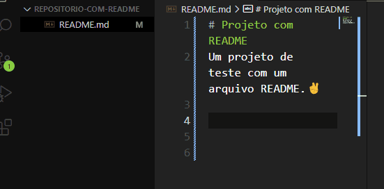

# Projeto com README
Um projeto de teste com um arquivo README.✌️

[](https://google.com)

## Tecnologias utilizadas
- HTML
- CSS
- JS

## Como utilizar

1- Clone o projeto
```
git clone <url>
```

2 - Acesse a pasta do projeto

```
cd repositorio-com-readme
```
